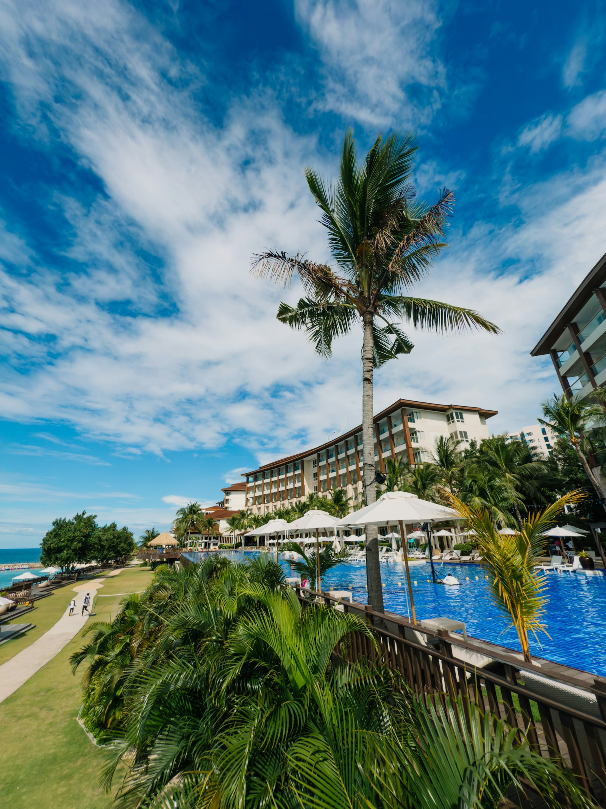

# hotel-sales-desk



**[Live site & pricing →](https://patrickwdavis.com/hotel-sales-desk/)**

Claude Code skills for hotel and resort sales & events teams running **Amadeus Delphi** (the `nihrm__` managed package on Salesforce) — automation for BEOs, group resumes, contracts, addenda, and sales inbox triage.

Built for hotels, resorts, and management companies running Delphi.fdc on Salesforce who want less manual data entry in their sales and catering department, not another system to log into. Built from real BEO, contract, resume and inbox workflows, generalized so no property, client, or staff data ships with the plugin. Every property-specific value lives in one config file you fill in.

## What it does

| Skill | Replaces |
|---|---|
| `delphi-beo` | Building, fixing, and generating Banquet Event Orders, packet assembly, sending for signature |
| `delphi-group-resume` | Producing the rooms/logistics resume from Delphi, filling what the template leaves blank |
| `delphi-contracts` | Generating contracts and addenda from your org's own Delphi templates, checking the revenue math |
| `sales-inbox-triage` | Sorting a day of inbox mail into action buckets and drafting on-brand replies |
| `property-setup` | Run once: discovers your org's Delphi IDs and template names, builds your config |

## Example property

The config example describes a fictional 400-room hotel with 40,000 sq ft of function space (an 18,000 sq ft divisible ballroom, an 8,000 sq ft junior ballroom, a 4,000 sq ft outdoor terrace, a boardroom, and 12 breakout rooms). Replace it with your own numbers.

## Install

```
/plugin marketplace add seven7rees/hotel-sales-desk
/plugin install hotel-sales-desk@hotel-sales-desk
```

## Setup

1. Authenticate your own Salesforce CLI to your Delphi org (`sf org login web`). Claude never handles your password.
2. Run the `property-setup` skill. It builds `.hotel-desk/property.yaml` from your org and a short interview.
3. Keep `.hotel-desk/property.yaml` out of source control if this repo is ever forked publicly. It describes a real property.

## Guardrails built into every skill

- Read-only until the user confirms. Live data before drafting, never invented rates or dates.
- Drafts only. Nothing sends or signs itself.
- Escalates legal, comp, discount, and above-threshold requests instead of acting on them.
- Never touches login pages or credentials.

## What this is not

Not a Delphi replacement, not a Salesforce admin tool, not legal advice. It automates the mechanical, repeatable parts of the job so a sales and events team spends less time on data entry and more time on the guest and the deal.

## Pricing

- **Setup — $1,000 one-time.** [Book →](https://buy.stripe.com/aFaeVc7km4MF6ZG0g5bQY00) — Delphi connection, config, a working session with your team.
- **Connectivity license — $200/month, per seat.** [Subscribe →](https://buy.stripe.com/dRmaEW9sua6ZabS8MBbQY01) — pick your seat count at checkout.
- Multi-property and management-company pricing available — open an issue or reach out directly.

## Who this is for

Directors of Sales & Marketing, catering and events managers, and sales coordinators at hotels, resorts, and conference centers running Amadeus Delphi (Delphi.fdc) on the Salesforce platform, looking to cut manual BEO, group resume, and contract work without replacing Delphi or hiring a Salesforce admin.

## Description

hotel-sales-desk is a Claude Code plugin that brings AI-assisted automation to hotel and resort sales and catering departments running Amadeus Delphi (Delphi.fdc) on Salesforce. It's built for the day-to-day work of a DOSM, catering manager, or sales coordinator: generating and fixing Banquet Event Orders (BEOs), producing group resumes, drafting group contracts and addenda from your property's own Delphi merge templates, and triaging a sales inbox into action items and on-brand replies. Unlike a generic Salesforce admin tool or a Delphi replacement, it's narrowly scoped to the repetitive, mechanical parts of hotel sales operations — the hospitality technology and sales-and-catering automation layer that sits on top of the hotel management software you already use, not another system to log into.

**Core topics:** Amadeus Delphi, Delphi Salesforce integration, hotel sales software, hotel and resort sales automation, banquet event order (BEO) software, group resume generation, hotel contract and addenda automation, sales inbox triage, catering and events software, hospitality technology, Claude Code plugin for hotels.

## License

See `LICENSE`.
